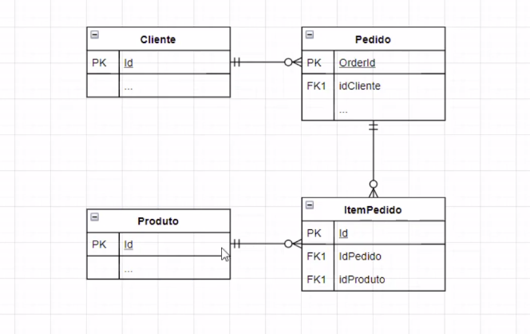

# SPRING-Expert-Udemy
Do Zero ao Expert em Spring Boot e todo o ecossistema Spring. Guia Completo e atualizado.

## Criar banco de dados
CREATE TABLE clientes (
ID INTEGER PRIMARY KEY AUTO_INCREMENT,
NOME VARCHAR(100),
CPF VARCHAR(11)
);

SELECT * FROM clientes ;
SELECT * from produtos p ;
CREATE TABLE produtos (
ID INTEGER PRIMARY KEY AUTO_INCREMENT,
DESCRICAO VARCHAR(100),
PRECO_UNITARIO NUMERIC(20,2)
);

CREATE TABLE pedidos (
ID INTEGER PRIMARY KEY AUTO_INCREMENT,
CLIENTE_ID INTEGER REFERENCES clientes (id),
DATA_PEDIDO TIMESTAMP,
STATUS VARCHAR(20),
TOTAL NUMERIC(20,2)
);

CREATE TABLE itens_pedidos (
ID INTEGER PRIMARY KEY AUTO_INCREMENT,
PEDIDO_ID INTEGER REFERENCES pedidos (id),
PRODUTO_ID INTEGER REFERENCES produtos (id),
QUANTIDADE INTEGER
);

CREATE TABLE usuarios (
ID INTEGER PRIMARY KEY AUTO_INCREMENT,
LOGIN VARCHAR(50) NOT NULL,
SENHA VARCHAR(255) NOT NULL,
ADMIN BOOL DEFAULT FALSE
);

SELECT * from usuarios u;

SELECT * from clientes c ;

INSERT INTO clientes (nome, cpf) values ('Rogerio Weber','42356887075');
INSERT INTO clientes (nome, cpf) values ('Cláudia Maria','61957455020');
INSERT INTO clientes (nome, cpf) values ('Aline Maria', '17560558070');
INSERT INTO clientes (nome, cpf) values ('Rodrigo Weber','38347367086');

INSERT INTO produtos (descricao,preco_unitario) values ('TV SAMSUNG 40 polegadas', 2000.0);
INSERT INTO produtos (descricao,preco_unitario) values ('Macbook PRO M1 MAX', 15000.0);
INSERT INTO produtos (descricao,preco_unitario) values ('TV LG 32 polegadas', 1500.0);

